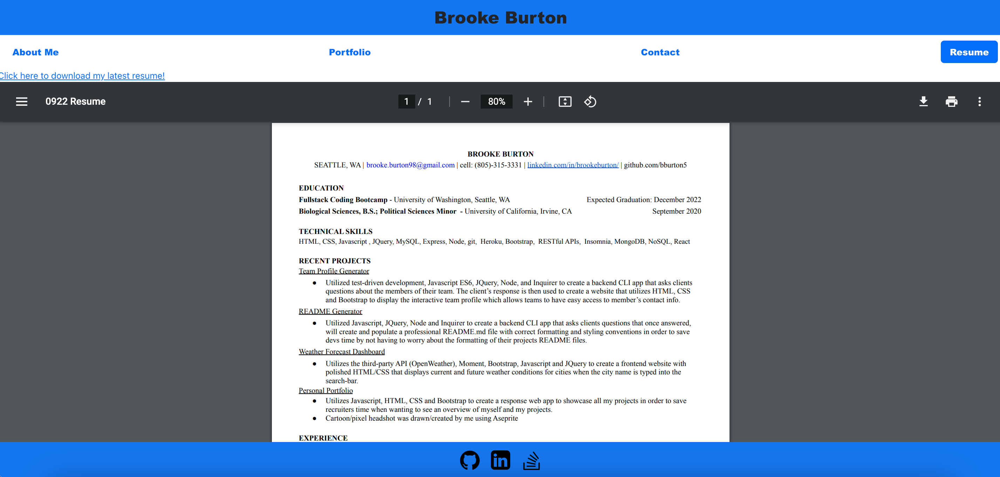

# react-portfolio

## This was created in order to showcase all my previous, current and upcoming software engineering projects. By working on this portfolio, i have better learned to utilize javascript, css, html, and REACT

## Links

- Repo: https://github.com/bburton5/my-react-portfolio
- Deployed App: https://bburton5.github.io/my-react-portfolio/

## Usage

This will be used to showcase all my skills, which i will update as i continue to work on projects.

## Credits

- StackOverflow
- MDN
- w3schools
- bootstrap

- ran npm run build
